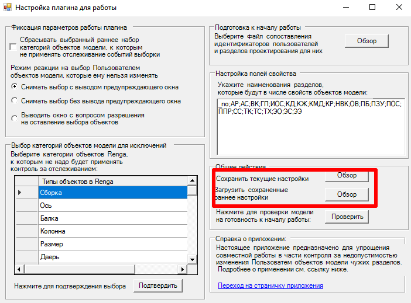

# Renga_FollowUsersActions
Плагин для САПР Renga для слежения за действиями пользователей в рамках командной работы над файлом (исключение вероятности изменения чужих элементов).

*Конечно, сделать полноценную блокировку объектов мы не можем, ввиду отсутствия необходимого API, но постарался сделать что-то очень похожее!* ©ModPlus ©Анастасия Голованёва  :)


# Описание
Настоящий плагин является частью расширенного курса по Renga API (середина июля 2022 г.), рассматривается логика работы с объектами модели, типами объектов, объектными свойствами, событиями выбора и открытия проекта. Плагин - это тестовая реализация механики запрета изменений объектов модели чужого раздела (при работе в среде одной модели Renga через Renga Collaboration Server).

## Принцип работы
Приведен в файле [HowUse.md](HowUse.md).

## Текущие ограничения
- не будут работать кнопки на главной панели для сохранения/загрузки параметров (пока не реализована логика) и непонятно, надо ли реализовывать сохранение неучитываемых типов, файлового путя к файлу параметров и пользовательские сокращения:


- среди объектов не учитывается категория Renga::ObjectTypes::Undefined, т.к. с ней замечены проблемы получения данных;

## Установка
1. Переходим в раздел [Releases](https://github.com/GeorgGrebenyuk/Renga_FollowUsersActions/releases) и загружаем последнюю версию в виде архива  ```Renga_FollowUsersActions_ver-**``` с наименованием плагина. 
2. Переходим в папку с установленной Renga и создаем там папку Plugins (при ее отсутствии).
3. Распаковываем скачанный архив в папку Plugins
Можно работать :)
