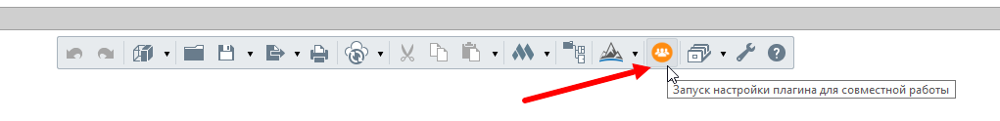
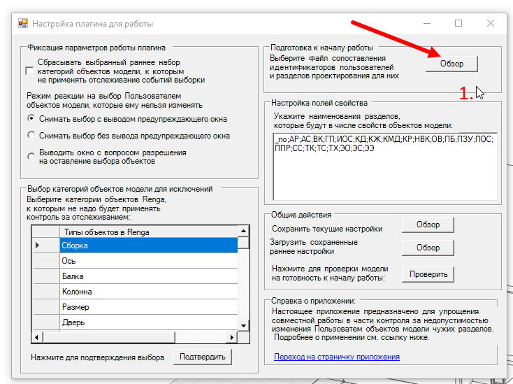
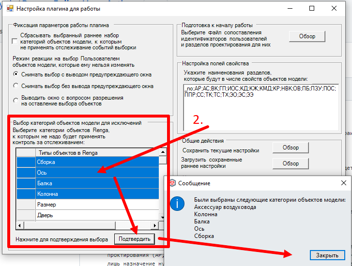
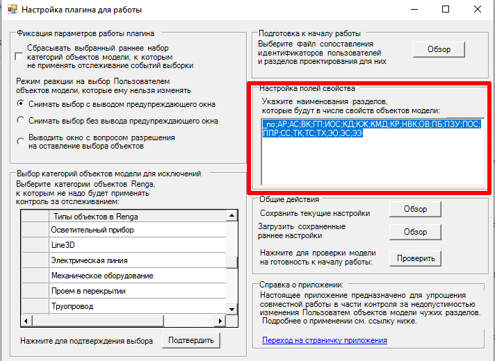
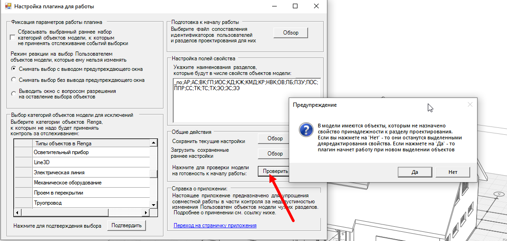
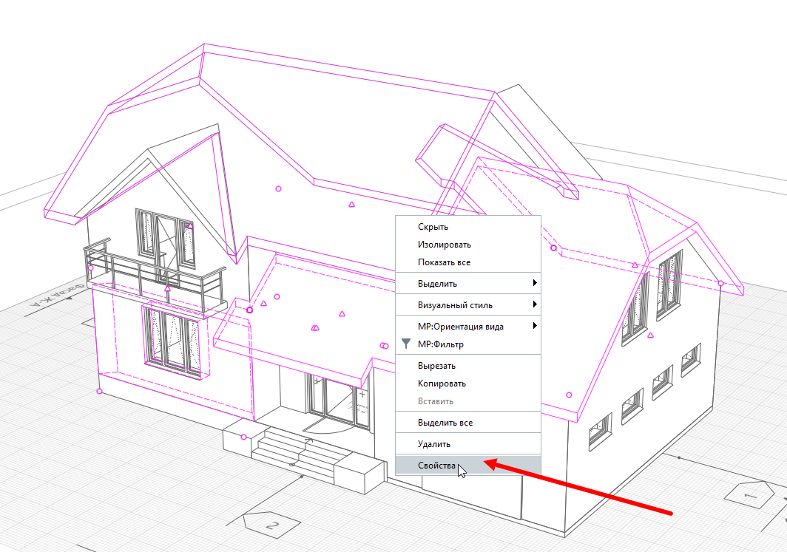
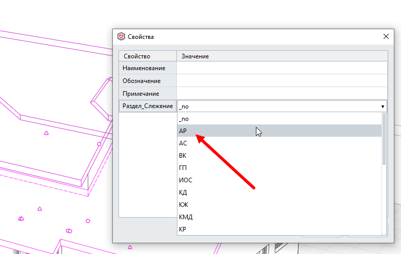

# Renga_FollowUsersActions
[Тестовая версия!] Плагин для САПР Renga для слежения за действиями пользователей в рамках командной работы над файлом (исключение вероятности изменения чужих элементов).

# Описание
Настоящий плагин является частью расширенного курса по Renga API (середина июля 2022 г.), рассматривается логика работы с объектами модели, типами объектов, объектными свойствами, событиями выбора и открытия проекта. Плагин - это тестовая реализация механики запрета изменений объектов модели чужого раздела (при работе в среде одной модели Renga через Renga Collaboration Server).

## Принцип работы
### Шаг №1
Плагин устанавливается у всех членов рабочей команды и после установки встраивается в Renga и доступен на Главной панели задач с любого вида. 


### Шаг №2
При запуске плагина первым делом необходимо выбрать текстовый файл, где будет прописано сопоставлние идентификатора пользователя с разрешенными для него разделами для редактирования.



Текстовый файл представляет собой построчное указание идентификатора пользователя: системный SID пользователя и перечисленные через ";" разделы проектирования. Пример файла вы можете посмотреть [здесь](demo_materials/). 
"Идентификаторы_системы_пользователя" - это так называемые SID (идентификатор безопасности учетной записи пользователя Windows), получаются [вот так](https://winitpro.ru/index.php/2016/05/27/kak-uznat-sid-polzovatelya-po-imeni-i-naoborot/).

### Шаг №3
(опциональный шаг)
Теперь необходимо выбрать категории объектов модели Renga, к которым не надо будет применять последующее отслеживание. Это надо делать через зажатый Ctrl щёлкая на короткие левые поля таблички в окне ниже. При нажатии после выделения на "Подтвердить" эти объекты будут внесены в исключение и выведены в информационное диалоговое окно в виде списка.



### Шаг №4
(опциональный шаг)
Вы можете сокрытить или дополнить список сокращений (идентификаторов) разделов проектирования в указанном текстовом поле. Разделять новые следует через ";". Главное -- не трогайте первое значение '''\_no''', так как оно применяется для маркировки незаполненных свойств или объектов, которые намеренно оставляют "общими".
Или вообще заменить разделы на фамилии пользователей, к примеру :)



### Шаг №5
После приведенных выше шагов можно нажать на кнопку "Проверить" для запуска валидации модели, включающей следующие пункты:
0. Фиксация параметров работы плагина - различные настройки
1. Проверяется, имеется ли наше свойство среди свойств модели и если нет, то добавляется в модель;
2. 
**Примечание:** новое свойство "Раздел_Слежение" будет иметь фиксированный Guid ```94f7fd69-2c9f-4c44-80b8-36524ab29a18``` (сгенерирован на лету через [https://www.guidgenerator.com](https://www.guidgenerator.com)).

3. Проверяется, назначено ли наше свойство всем (кроме оговоренных) категориям объектов Renga, и если нет - то назначается;
4. Проверяется, заполнено ли свойство у всех объектов модели (кроме категорий оговоренных выше), и если не заполнено - выскакивает предупреждающее окно, запрашивающее начать ли работу. Если выбирается 'Нет' - то в модели остаются объекты с незаполненными параметрами, остальные (заполненные) скрываются и для продолжения Пользователю надо будет заново вызвать эту опцию; в противном случае, при нажатии 'Да', can_start_following = true и плагин начинает работу (при каждом новом выделении пользователем объектов модели)



### Шаг №5.1 (если выбирается "Нет")
В этом случае скрываются те объекты модели, которые выбраны как категории объектов для исключения и те, у которых не заполнено свойство принадлежности к разделу проектирования (то есть стоит параметр '''\_no'''). Объекты могут выбираться разными способами (например, через раннее настроенные фильтры). Для выделенных объектов вызывается стандартное окно "Свойства" и в графе Свойства для нашего параметры вы выбираете нужный раздел.





